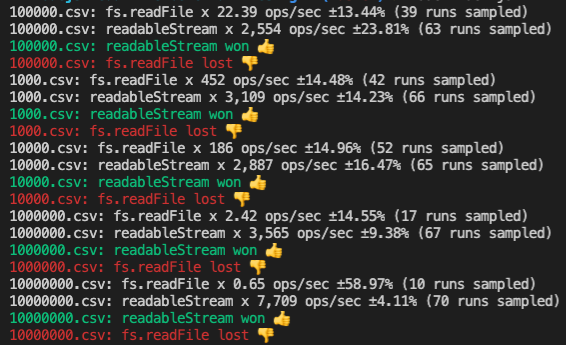

This repository is to compare performances between the fs.readFile function and the ReadableStream.

## Setup

Install npm packages.

```
yarn
```

Create CSV files to measure benchmark.

## Getting benchmark

To get benchmark, this repo uses benchmark.js.
Just execute the following command to get benchmark.

```
yarn bench
```

If the command succeeds, the results output like the following image:


 
## Getting execution time
 
WIP: Coming soon...

## LICENSE
[MIT](./LICENSE)
